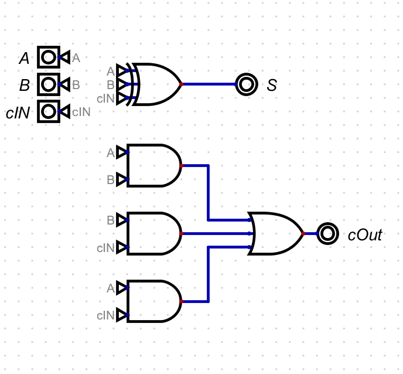
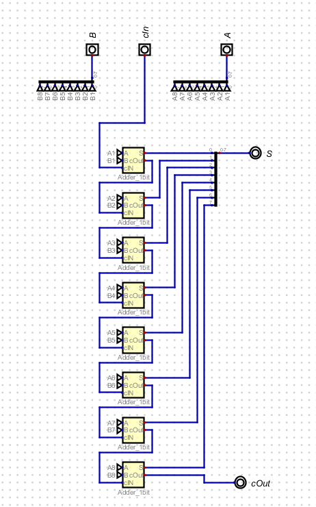

# 1. Visão Geral

A ALU (Arithmetic and Logic Unit) é o núcleo de processamento de dados de qualquer CPU. Ela funciona como uma calculadora digital de alta velocidade, encarregada de executar todas as operações matemáticas e comparações lógicas solicitadas pelo sistema. Sem a ALU, o computador seria incapaz de transformar dados brutos em informações úteis.

Nessa atividade, o aluno deve conseguir criar uma ALU capaz de reproduzir as seguintes tarefas:

- Adição (8 bits)
- Subtração (8 bits)
- Multiplicação (16 bits (8/8))
- Divisão (8 bits)
- Shift Lógico

A tarefa foi realizada na plataforma Digital, que reproduz funções lógicas do computador e permite que os usuários usufruam de portas lógicas para criar sistemas combinatórios.

# 2. Informações Gerais do Aluno

**Nome:** João Pedro Gonçalves Corrêa Araujo
**Turma:** T16
**Grupo:** 5

# 2. Componentes Criados

## 2.1 Somador de 1 bit

Para criar um somador de 8 bits, inicialmente é necessário criar um somador de 1 bit utilizando portas lógicas e escalonando para usufruir de uma maior quantidade de bits. Dessa forma, a primeira forma era entender como criar um somador de 1 bit. Para isso, foi necessário entender todas as combinações possíveis para a soma de 1 bit. Dessa forma, se fez necessário criar a tabela verdade da operação.

| A | B | S |
|---|---|---|
| 0 | 0 | 0 |
| 0 | 1 | 1 |
| 1 | 0 | 1 |
| 1 | 1 | 1 |

Para que o circuito funcione em série (escalonado), ele deve ser capaz de processar não apenas os dois bits atuais, mas também o transporte vindo da casa anterior. É o que chamamos de Carry In (Cin).Essa lógica simula exatamente o que fazemos na aritmética decimal: ao somar $9 + 9$, o resultado excede a unidade, gerando uma dezena que deve ser somada na coluna seguinte. No somador de 8 bits, o Cout do "Bit 0" se torna o Cin do "Bit 1", criando uma reação em cadeia que permite processar números de maior casas de unidade.

Após realizar a tabela verdade, basta encontrar um circuito que atenda as condições. O circuito montado foi o seguinte:

## 2.1.2 Somador de 8 bits

Agora, para aumentar a quantidade de bits permitidas pelo circuito, basta encadear vários somadores de 1 bits, conectandos cOut do anterior, no cIn do próximo, como na imagem abaixo:

Dessa forma, ao inserir os valores, o circuito calcula corretamente o resultado esperado.

# 3. Vídeo

